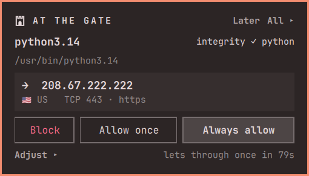
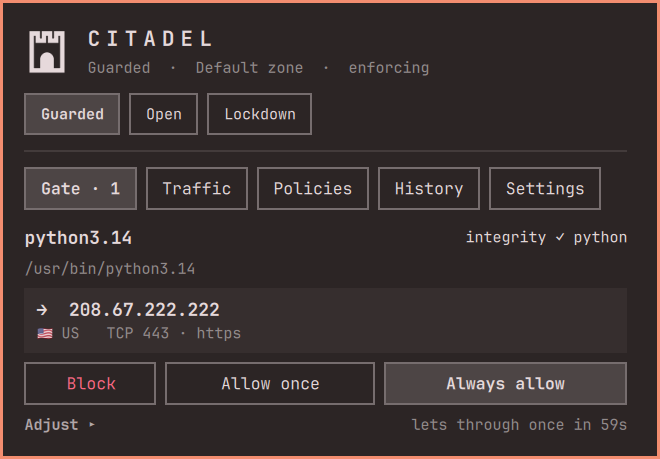
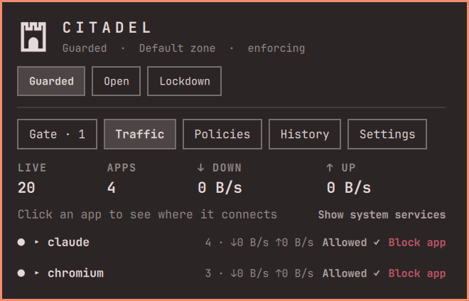
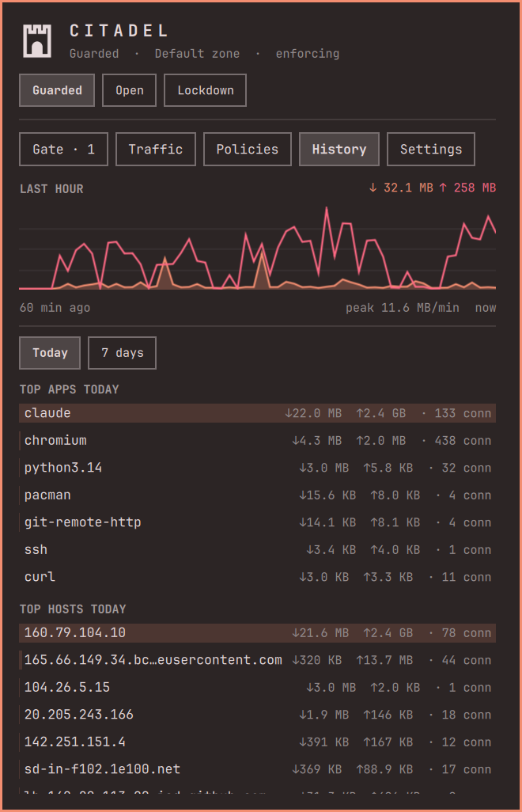
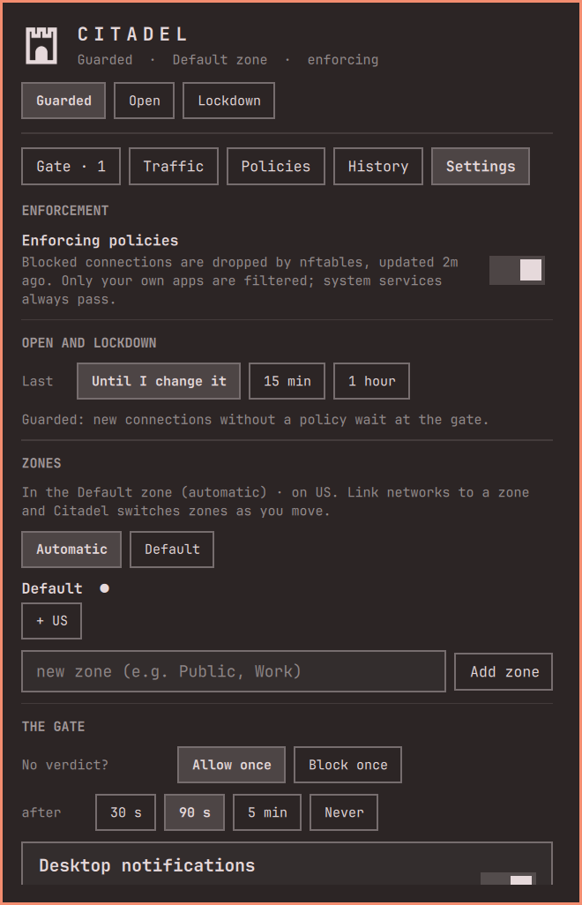

# Citadel

Citadel is an outbound firewall for the Omarchy bar. Your apps sit inside the
walls. Whenever one tries to reach somewhere new, it waits **at the gate** for your verdict.
Everything you decide becomes a **policy** that Citadel enforces with nftables.

<p align="center">
  
</p>

## Install

### 1. Prerequisite for blocking: citadel-helper

Citadel watches and asks without any extra software. To actually **block**
traffic it needs **[citadel-helper](https://github.com/NeatOuk/citadel-helper)**,
a small root helper that turns your policies into nftables rules. **Citadel needs
citadel-helper 1.1.1 or newer** ([tag `v1.1.1`](https://github.com/NeatOuk/citadel-helper/releases/tag/v1.1.1)),
which only ever closes your own connections. Settings warns if an older helper
is installed. Build and install it once:

```bash
git clone https://github.com/NeatOuk/citadel-helper.git
cd citadel-helper && makepkg -si
```

An AUR package is coming later.

Its README explains what runs as root and why it is safe. You can install it
before or after the plugin; Citadel picks it up within a few seconds.

### 2. The plugin

```bash
omarchy plugin add https://github.com/NeatOuk/citadel.git --enable
```

Then open Citadel from the tower icon in the bar. Go to **Settings → Enforcement** and turn it on.

### Remove

```bash
omarchy plugin remove neat.citadel     # disables it (off the bar) and deletes the folder
sudo pacman -R citadel-helper          # if installed; switches enforcement off first
rm -rf ~/.local/share/citadel          # optional: your policies, history, feeds and GeoIP data
```

Citadel never edits your own configuration files. It only writes to `~/.local/share/citadel/`.

### Requirements

| Need | Package | Notes |
|---|---|---|
| Omarchy shell | Omarchy **4.x** | Settings warns on another major version |
| Watch process | `python` | standard library only |
| Connection list, cutting connections | `iproute2` | |
| Integrity check | `pacman` | Arch-based systems |
| Notifications, clipboard import/export | `libnotify`, `wl-clipboard` | part of Omarchy |
| Zone switching | `networkmanager` **or** `iwd` | wired links are detected either way; with neither, pick zones by hand |
| Countries and network owners | `python-maxminddb` | optional; the databases download from Settings |
| Proxy logins | `libsecret` (`secret-tool`) and a keyring such as gnome-keyring | only for proxies that need a username and password |
| Explain | an Omarchy default agent (`omarchy agent --pick`) or any command-line AI tool | optional; see [Explain](#explain) |
| Enforcement | [`citadel-helper`](https://github.com/NeatOuk/citadel-helper) (built with `makepkg`) → `nftables`, `polkit` | kernel with `nft_socket`, cgroup v2 and `INET_DIAG_DESTROY` (stock Arch has all three) |
| Password-free enforcement | membership in `wheel` | otherwise polkit asks for an admin password each time |

## At a glance


- **The tower** in the bar shows Citadel's state:
  - the gate door is closed while **Guarded**
  - the arch is empty while **Open**
  - portcullis bars are down in **Lockdown**
  - dim means *watching only*
  - a badge counts connections waiting at the gate
- **At the gate:** a card under the tower shows the app, its integrity, and where it wants to go (host, country, port).
  - Choose **Block**, **Allow once** or **Always allow**.
  - **Adjust** sets what the verdict covers: this port, this host or every host. It also sets how long it lasts: from now on, or until the app quits.
- **Modes:**
  - **Guarded** asks about new connections.
  - **Open** lets everything pass quietly, and logs it.
  - **Lockdown** blocks everything that isn't allowed.
  - Open and Lockdown can end on their own after 15 min or 1 h.
  - Right-click the tower for an hour of Open.

## The panel

<table>
  <tr>
    <td></td>
    <td></td>
  </tr>
  <tr>
    <td align="center"><b>Gate</b>: connections waiting for your verdict</td>
    <td align="center"><b>Traffic</b>: what is leaving right now, per app</td>
  </tr>
  <tr>
    <td></td>
    <td></td>
  </tr>
  <tr>
    <td align="center"><b>History</b>: the last hour, top apps, hosts and countries</td>
    <td align="center"><b>Settings</b>: enforcement, zones and how the gate behaves</td>
  </tr>
</table>

| Tab | What's there |
|---|---|
| **Gate** | Every connection waiting for a verdict. |
| **Traffic** | Live connections grouped by app: host, country, ports, bytes and rate in both directions, and why each one is allowed or blocked. Allow or Block an app, or a single destination. With proxies set up, a **Proxy** tab shows each proxy's health, what it carries now and in the last 5 minutes, the policies routing through it, and recent failures. |
| **Policies** | Your policies. Each can cover an app, a host (domains include subdomains), an IP or CIDR, a port, or a combination. Scope them to a zone or to all zones. The most specific policy wins, and Block wins ties. An Allow policy can also set a **Route** (direct or via a proxy, see [Proxy routing](#proxy-routing)). Search by app, host, IP or proxy; show only the ones **added by you**, **from the gate**, blocks or proxy routes; sort newest first or by precedence. Edit or remove them, or export and import through the clipboard. |
| | **Threat feeds:** IP feeds (FireHOL, Spamhaus DROP) go straight into the firewall. Domain feeds (StevenBlack, HaGeZi) block matching host names. LAN, loopback, Tailscale/CGNAT and multicast ranges are always removed from IP feeds. Feeds refresh daily. |
| **History** | Traffic over the last hour, top apps and hosts (today or 7 days), countries, and the log of verdicts. |
| **Settings** | Enforcement, **proxies** and where everything else goes, the timer for Open and Lockdown, **zones** (link Wi-Fi or wired networks and Citadel switches as you move), what happens to an unanswered request, notifications, refresh rate, history retention, the country and network-owner databases, and **Explain**. |

**Who started it.** Tools like `curl`, `wget` or `git` are started by
something else, so Citadel shows the **launcher** too:
- `curl via omarchy-network-speedtest` for a script, or `claude in ghostty` when you started it in a terminal
- the command line, with passwords, tokens, `Authorization` headers and request bodies masked
- the full launch chain, under **Adjust**

At the gate, a verdict can cover the app **only when started by that
launcher**, so allowing curl for your speed test doesn't allow curl for everything.

**Short connections.** Many tool connections last less than a second, too short
to catch between two checks. With enforcement on and citadel-helper 1.2 or
newer, the helper logs each new connection from your apps to the kernel log
(rate-limited). Citadel reads it live and matches the connection to the process
that made it. Traffic shows these under **Just now**, each with a label saying
how sure the match is:
- **matched:** the command, or its launcher script, names that host
- **likely:** matched by timing
- **app unclear**

Only matched or likely connections are sent to the gate. The log lines are also
kept in your system journal like any kernel message. Turn this off under
**Settings → Catch short connections**.

**Integrity** stands in for code signing. Each program is checked against the sha256 that pacman recorded for its package. The levels are **verified**, **modified**, **not packaged** and **suspicious** (runs from `/tmp`, or deleted). If a program you allowed changes without a package update, it comes back to the gate.

## Proxy routing

Like Proxifier, Citadel can send chosen apps through a proxy while everything
else goes direct. For example, a mail app goes via `172.16.1.3:8080` while the browser goes direct.

1. **Settings → Proxies**: add a proxy (**HTTP**, **HTTPS** or **SOCKS5**, with an optional username and password). **Check** tests it end to end.
2. Give an **Allow** policy a **Route**: *Default*, *Direct* or *via &lt;proxy&gt;*. At the gate, **Adjust → Always allow routes it** does the same.
3. **Everything else** in Settings sets the route for traffic no policy covers.

Block stays Block. Routing is part of allowing, and the most specific policy
decides both. Traffic shows `via <proxy>` on routed connections.

**How it works.** citadel-helper (1.3 or newer) redirects the routed apps' TCP
connections to a local port of `bin/citadel-proxy`. That process reads each
connection's original destination and opens it through the proxy (SOCKS5
CONNECT, HTTP CONNECT, or CONNECT over TLS for HTTPS proxies).

**Host names.** Many proxies, filtering ones especially, refuse a tunnel to
a bare IP address. Citadel reads the host name the app asks for (the TLS server
name, or the HTTP `Host` header) and connects through the proxy by name. It
uses that name only when it resolves to the address the firewall let through,
so an app can't name some other host to get around a block.

**Fails closed.** If the proxy is down or refuses, the app's connection is reset
and never sent direct. The failure is logged in Settings and in History. The
same holds when Citadel itself isn't running: the redirect stays, so routed apps
get no connection at all.

Good to know:
- Only **TCP** is proxied. A routed app's UDP is blocked (except DNS), so browsers fall back from QUIC to TCP.
- DNS still goes out through your normal resolver.
- An app route is exact. A **host** route covers the addresses Citadel has resolved or seen for that host, so the very first connection to a brand-new address can take the default route. The policy editor warns about this.
- Web apps share Chromium's process, so they can only be routed by host.
- Proxy logins are kept in your desktop keyring (`secret-tool`), never in Citadel's files.
- Routing needs enforcement on.

## Explain

The gate card shows the destination's **owner** straight away (e.g. *Owner:
Google LLC*), from the free DB-IP ASN database. **Explain** goes further: it asks
an AI agent which company and service is behind the connection, what it's
likely for, and whether to allow or block it, e.g. *DoubleClick · Google — ad
serving and tracking (ads). Suggests: Block*.

- **Which agent.** Citadel asks your own Omarchy **default agent** (`omarchy agent --pick`) through its one-shot mode:

  | Agent | Command |
  |---|---|
  | claude | `claude -p` |
  | codex | `codex exec` |
  | copilot | `copilot -p` |
  | crush | `crush run` |
  | cursor-agent | `cursor-agent -p` |
  | gemini | `gemini -p` |
  | opencode | `opencode run` |
  | pi | `pi -p` |

  - For any other tool, set a **custom command** in Settings, e.g. `mytool --print {prompt}`.
  - With neither set, Explain stays off and the card says how to turn it on.
- **Only on demand.** Nothing is sent until you press Explain.
- **What it sends:** the app, its launcher, the command line with secrets masked, and the destination. A cloud agent sends these to its provider; a local one (e.g. pi with Ollama) keeps them on your network.
- **Model and cost.** The agent uses its own default model. Settings has an optional model override, e.g. a small, fast one.
- **Saved answers.** Answers are kept for 30 days per app, domain and port. **Ask again** gets a fresh one.
- **Test.** The button in Settings checks the setup.

## Import from AdGuard, Pi-hole and hosts files

**Policies → Import ▸** takes:
- AdGuard / AdGuard Home rules
- Pi-hole allow and deny lists
- hosts files
- plain domain lists
- Citadel's own export

Paste them, or fetch them from a URL (GitHub page links work).

| Rule | Becomes |
|---|---|
| `\|\|ads.example.com^` (also with `$important`) | a Block policy |
| `@@\|\|good.example.com^` | an Allow policy (wins over a block of the same domain, as in AdGuard) |
| `0.0.0.0 ads.example.com` | a Block policy |
| a plain domain | Block or Allow, as you choose (Pi-hole allowlists are plain lists) |

Up to 200 blocked domains become policies you can see and edit. Bigger lists,
like HaGeZi or OISD, become a **feed**. Fetched from a URL, the feed refreshes daily.

Regex rules and AdGuard options such as `$client=` or `$dnsrewrite` have no
Citadel equivalent. They're skipped, and the import tells you how many.

**Not a DNS ad blocker.** Citadel blocks connections per app, so a listed
domain is caught when Citadel knows the connection's host name, from its own
name lookups or the app's request. Pi-hole and AdGuard Home block the DNS
lookup itself. They work well together.

## Enforcement

Watching and the gate work without root. To actually **drop** blocked traffic,
Citadel uses [citadel-helper](https://github.com/NeatOuk/citadel-helper). See
[Install](#install). Then switch **Settings → Enforcement** on. The helper provides:

- `/usr/lib/citadel/citadel-enforcer`: root-owned. It accepts only validated IPs, ports and cgroups inside your own user slice, and only touches `table inet citadel`.
- a polkit rule, so the active local `wheel` user can run exactly that helper without a password (anyone else is asked for an admin password)
- `citadel-restore.service`, which restores your policies at boot
- `citadel-off`, an emergency off switch for any terminal

Remove it with `sudo pacman -R citadel-helper`. That also switches enforcement off.

The helper's own [README](https://github.com/NeatOuk/citadel-helper#readme) covers its security model and commands.

Blocking is per app, not per address. nftables matches the app's own systemd scope (`socket cgroupv2`), so "block Chromium" stops Chromium while other apps can still reach the same server. Blocking a host also ends its live connections (`ss -K`).

What the firewall never touches:
- System services such as WARP, NetworkManager and DNS always pass.
- Established connections are only cut on purpose.

## Good to know

- **The first packet may leave.** Citadel sees a new connection within one refresh, and a moment before it answers the gate. Every later attempt follows your verdict.
- **Very short connections** are caught through the kernel log when *Catch short connections* is on (helper 1.2+). Without it they can slip between refreshes.
- **Command-line tools inside a terminal** share the terminal's scope, so their policies are enforced per destination within that scope. The policy is marked this way.
- **Blocking an interpreter** (e.g. `python3.14`) blocks every program running on it.
- **Host names come from reverse DNS.** CDNs may show their own names, and domain feeds only match names Citadel knows.

## Files

```
neat.citadel/
├── Panel.qml, CitadelIcon.qml   tower icon, gate card, panel + tabs
├── Service.qml                  state, policies, persistence, helper calls
├── Model.js                     matching, precedence, nft spec (tests/model.test.js)
├── views/                       Traffic, Policies, History, Settings, VerdictCard
├── docs/screenshots/            images used in this README
├── bin/citadel-monitor          python watch process (ss, /proc, rDNS, GeoIP, sqlite)
├── bin/citadel-proxy            per-app proxy tunnels (SOCKS5 / HTTP / HTTPS CONNECT)
├── bin/citadel-explain          asks your agent about a connection (tests/test_explain.py)
~/.local/share/citadel/          state.json, history.db, feeds, GeoIP, enforce spec
```

Tests:
- `node tests/model.test.js`: logic
- `python3 tests/test_explain.py`: Explain adapters, with fake agents
- `python3 tests/test_proxy_unit.py`: host-name handling of the proxy (TLS server name, HTTP Host, resolution check)
- `python3 tests/test_proxy_e2e.py`: proxy routing end to end, in a private network namespace (needs citadel-helper's source next to this repo, or `CITADEL_ENFORCER`)

## Third-party data

Citadel bundles no third-party data. It downloads these only when you ask:

| Data | Publisher | When |
|---|---|---|
| Country and network-owner (ASN) databases | [DB-IP Lite](https://db-ip.com), CC BY 4.0 | Settings → Download |
| FireHOL Level 1 | [FireHOL](https://iplists.firehol.org/) | when you enable the feed |
| Spamhaus DROP | [Spamhaus](https://www.spamhaus.org/blocklists/do-not-route-or-peer/) | when you enable the feed |
| StevenBlack hosts | [StevenBlack/hosts](https://github.com/StevenBlack/hosts) | when you enable the feed |
| HaGeZi Light | [hagezi/dns-blocklists](https://github.com/hagezi/dns-blocklists) | when you enable the feed |

Each feed is published under its own license and terms of use; check them before relying on a feed.

## License

MIT, see [LICENSE](LICENSE).
